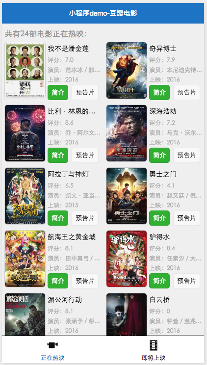
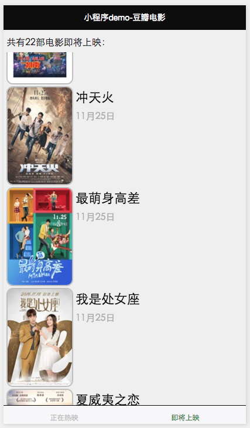
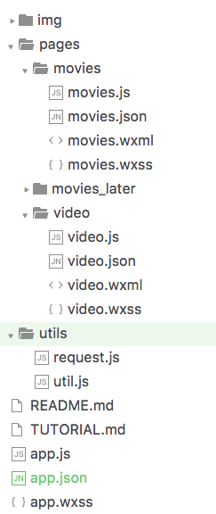
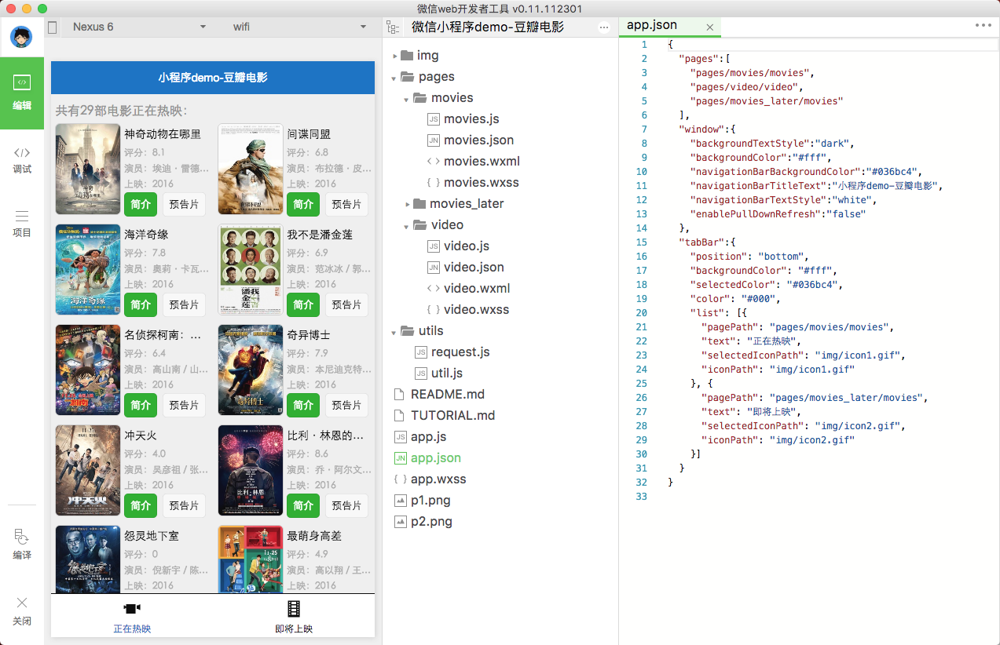
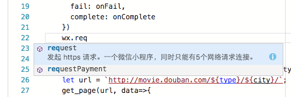
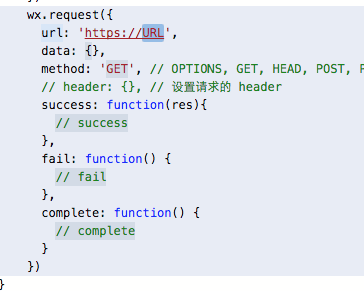
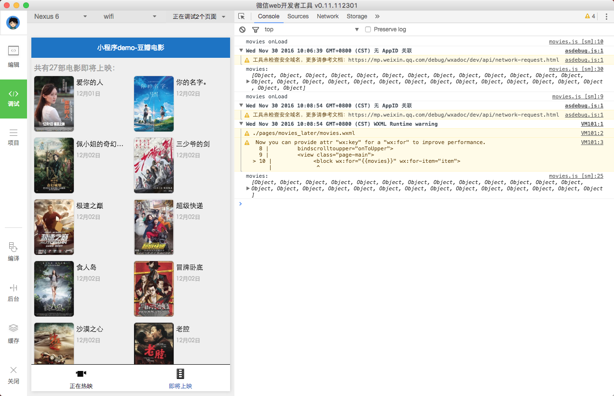
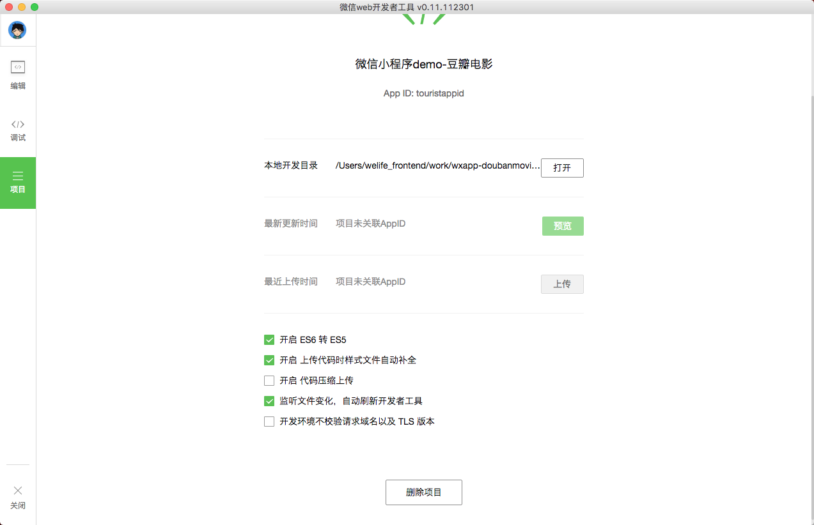
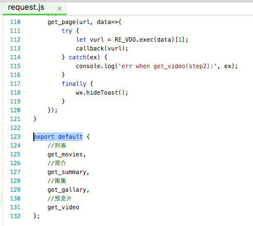

<br/><br/><br/>
<center>

</center>
<br/><br/><br/>
<center>
#程序猿的一小步-做一个简单的小程序DEMO#
</center>
<br/><br/><br/>
-------------------------

## <center>本次DEMO预览</center><br/>
> 抓取豆瓣的页面，演示基本组件的用法

|||
|-----|-----:|
|||
<br/><br/>

## <center>对于程序猿来说，小程序是什么</center><br/>
> 张小龙："不需要下载安装即可使用的应用...应用将无处不在，随时可用，但又无需安装卸载"

- 基于微信的封闭生态，又一个 RIA（Rich Internet Applications）轮子
- 并非真正的原生，也并非传统意义的H5页面，微信基于js/css/html定义了新的文件格式
- 比之基于网页的服务号，多了缓存、录音、保存文件等接近原生的能力，及支付、模版消息等微信的功能
- 原理就是用JS调用底层native组件，和React Native非常类似
- 微信提供了开发框架、丰富又有限的基本组件及API、兼容性解决方案，和类似React的开发方法
<br/><br/>

## <center>当前阶段小程序的限制</center><br/>
- 现阶段不允许分享，不允许外部链接
- 无法使用less或者sass之类的预编译
- 开发工具和真机表现偶尔会有差异
- 有时候代码无故不生效，需要重启才行
<br/><br/>

## <center>规定的目录结构</center><br/>

<br/><br/>

## <center>文件类型</center><br/>
- WXML 是框架设计的一套标签语言，结合基础组件、事件系统，可以构建出页面的结构
- WXSS 是一套样式语言，与 CSS 相比扩展了自适应尺寸单位、样式导入等
- json文件用来对全局或页面进行配置，决定页面路径、窗口表现、网络超时、底部tab 等
- js文件管理具体业务逻辑，并用`App()`和`Page()`注册应用和页面，打开选项后可用ES6语法
<br/><br/>

## <center>设计规范和自适应尺寸单位</center><br/>
- WXSS(WeiXin Style Sheets)是一套样式语言，具有 CSS 大部分特性，可以看作一套简化版的css
- rpx（responsive pixel），规定屏幕宽为750rpx
- 设计图要求尺寸为750px，元素尺寸直接写成 `[设计图尺寸]rpx`
- rpx换算px (屏幕宽度/750)，以iphone5为例： 1rpx = (320/750)rpx = 0.42px
- px换算rpx (750/屏幕宽度)，以iphone5为例： 1px = (750/320)rpx = 2.34rpx
- 也支持rem（root em），规定屏幕宽度为20rem；1rem = (750/20)rpx 
- 推荐使用 flex 完成大部分布局
- 用 `@import "xxx.wxss";` 导入样式
- 定义在 app.wxss 中的样式为全局样式，作用于每一个页面
- 在 page 的 wxss 文件中定义的样式为局部样式，只作用在对应的页面，并会覆盖全局样式
<br/><br/>

## <center>js文件的包管理</center><br/>
- 用 `require()` 或ES6的 `import`
- 用 `module.exports =` 或ES6的 `export default`
<br/><br/>

## <center>页面导航</center><br/>
- 在 `app.json` 中定义页面入口
- 用 `wx.navigateTo` 跳转
- 限制最多打开5个页面

    ````
    //跳到目标页，并传递参数
    wx.navigateTo({
        url: `../video/video?v_url=${url}`
    });
    ...
    //在目标页接受参数
    onLoad(option) {
        console.log(option.v_url);
    },
    ````
<br/><br/>

## <center>网络请求</center><br/>
> wx.request发起的是 HTTPS 请求。一个微信小程序，同时只能有5个网络请求连接

    ````
    wx.request({
      url,
      data: [Object|String],
      method: 'GET',
      header: {
          'Content-Type': 'text/html; charset=utf-8'
      },
      success: res=>console.log(res.data),
      fail: [Function],
      complete: [Function]
    })
    ````
<br/><br/>

## <center>开发工具</center><br/>
- [官方开发工具](https://mp.weixin.qq.com/debug/wxadoc/dev/devtools/download.html?t=20161122) 可以实时编译预览，写代码体验较差
- [Egret Wing](https://www.egret.com/downloads/wing.html) 可以预览单个页面，无法调适
<br/><br/>










<br/><br/>

## <center>开发细节</center><br/>

### _用`app.js`注册程序_

    ````
    App({
      onLaunch: function() { 
          // 生命周期函数--监听小程序初始化
      },
      onShow: function() {
          // 生命周期函数--监听小程序显示
      },
      onHide: function() {
          // 生命周期函数--监听小程序隐藏
      },
      xxx: '自定义函数或数据'
    })
    ````

> 在页面中调用全局的 getApp() 函数，可以获取到小程序实例

<br/><br/>

### _用`app.json`配置全局_

    ````
    {
      "pages":[
        "pages/movies/movies",
        "pages/video/video",
        "pages/movies_later/movies"
      ],
      "window":{
        "backgroundTextStyle":"dark",
        "backgroundColor":"#fff",
        "navigationBarBackgroundColor":"#036bc4",
        "navigationBarTitleText":"小程序demo-豆瓣电影",
        "navigationBarTextStyle":"white",
        "enablePullDownRefresh":"false"
      },
      "tabBar":{
        "position": "bottom",
        "backgroundColor": "#fff",
        "selectedColor": "#036bc4",
        "color": "#000",
        "list": [{
          "pagePath": "pages/movies/movies",
          "text": "正在热映",
          "selectedIconPath": "img/icon1.gif",
          "iconPath": "img/icon1.gif"
        }, {
          "pagePath": "pages/movies_later/movies",
          "text": "即将上映",
          "selectedIconPath": "img/icon2.gif",
          "iconPath": "img/icon2.gif"
        }]
      }
    }
    ````
<br/><br/>

### _集中定义网络请求等工具方法_
> 小程序开发中，一般把网络请求、全局工具方法等，集中定义在 utils 文件夹中
 

<br/><br/>

### _视图层模板-`.wxml`文件_

    ````
    <view class="movies" catchtap="onPageClick">
        <view class="page-title" wx:if="{{movies.length}}">
            共有{{movies.length}}部电影正在热映：
        </view>
        <scroll-view scroll-y="true" style="height:{{scrollHeight}}px"
            bindscrolltoupper="onToUpper">
            <view class="page-main">
                <block wx:for="{{movies}}" wx:for-item="item" wx:key="movie">
                    <view class="box">
                        <view class="pic" id="pic_{{item.id}}" catchtap="onGallaryClick">
                            <image src="{{item.image}}"></image>
                        </view>
                        <view class="info">
                            <view class="title ellipsis">{{item['data-title']}}</view>
                            <view class="others">
                                <view class="line ellipsis">评分：{{item['data-score']}}</view>
                                <view class="line ellipsis">演员：{{item['data-actors']}}</view>
                                <view class="line ellipsis">上映：{{item['data-release']}}</view>
                            </view>
                            <view class="btns">
                                <button type="primary" size="mini"
                                    id="btn_{{item.id}}"
                                    catchtap="onSummaryClick">简介</button>
                                <button type="default" size="mini"
                                    id="play_{{item.id}}"
                                    catchtap="onVideoClick">预告片</button>
    </view></view></view></block></view></scroll-view></view>
    ````

- view，小程序主要的布局元素，类似于html标签的div
- 比之用view去做overflow，scroll-view提供了更为强大的功能和更好的性能
- button 按钮等组件基本对应于 [weui](https://github.com/weui/weui)
- 类似于react，动态数据均来自对应 Page 的 data
- 条件渲染和循环渲染等由 `wx:if` `wx:for` 等属性完成
- 事件由 `bindxxx` 和 `catchxxx` 指定，后者不冒泡
- 没有`click`事件，而是`tap`
<br/><br/>

### _用`.js`文件管理页面逻辑_

    ````
    import req from '../../utils/request';

    Page({
        _cache: [],
        data: {
            movies: [],
            scrollHeight: 0
        },
        onLoad() {
            this.fetchData();
        },
        onShow: function () {
            wx.getSystemInfo({
                success: res=>{
                    let topH = 60; //顶部区域高度
                    let rpx = topH*(res.windowWidth/750); //rpx转px 屏幕宽度/750
                    this.setData({
                        scrollHeight: parseInt(res.windowHeight - rpx)
                    });
                }
            });
        },
        fetchData() {
            if (this._cache.length) {
                this.setData({movies: this._cache});
                return;
            };
            req.get_movies('nowplaying', movies=>{
                console.log('movies: ', movies);
                this._cache = movies;
                this.setData({movies})
            });
        },
        _eventTS: null,
        onSummaryClick(e) {
            if (e.timeStamp === this._eventTS) return;
            this._eventTS = e.timeStamp;
            req.get_summary(e.currentTarget.id.replace('btn_', ''), summary=>{
                wx.showModal({
                    title: '简介',
                    content: summary
                });
            });
        },
        onGallaryClick(e) {
            if (e.timeStamp === this._eventTS) return;
            this._eventTS = e.timeStamp;
            req.get_gallary(e.currentTarget.id.replace('pic_', ''), urls=>{
                wx.previewImage({
                    urls
                });
            });
        },
        onVideoClick(e) {
            if (e.timeStamp === this._eventTS) return;
            this._eventTS = e.timeStamp;
            req.get_video(e.currentTarget.id.replace('play_', ''), url=>{
                console.log('video playing...', url);
                wx.navigateTo({
                    url: `../video/video?v_url=${url}`
                });
            });
        }
    });
    ````
<br/><br/>

### _用`.wxss`定义局部样式_

    ````
    .page-title {
        color: rgb(142, 142, 142);
        font-size: 30rpx;
        line-height: 60rpx;
        height: 60rpx;
    }
    .page-main {
        display: flex;
        flex-direction: row;
        flex-wrap: wrap;
        justify-content: space-between;
        align-items: flex-start;
    }
    .box {
        overflow: hidden;
        width: 48.5%;
        display: inline-flex;
        flex-direction: row;
        margin-bottom: 15rpx;
    }
    ...
    .info .others .line {
        align-items: center;
        width: 200rpx;
    }
    ````
<br/><br/>

## <center>DEMO源码</center><br/>
[https://github.com/tonylua/wxapp-doubanmovie-demo](https://github.com/tonylua/wxapp-doubanmovie-demo)
<br/><br/>

## <center>参考资料</center><br/>
- https://mp.weixin.qq.com/debug/wxadoc/introduction/index.html?t=20161122
- http://www.jianshu.com/p/060c6f3dd4e8
- http://blog.csdn.net/yulianlin/article/details/52621413
- http://mp.weixin.qq.com/s?__biz=MjM5NzQxMDkwMg==&mid=2655403125&idx=1&sn=09086f186ebbbf843ae41afb52a69a63&chksm=bd68fd4c8a1f745a13b9c3e44eac536db05342da90c8fa40eead911959f00a9e1d3c11b31e80&scene=0#rd
